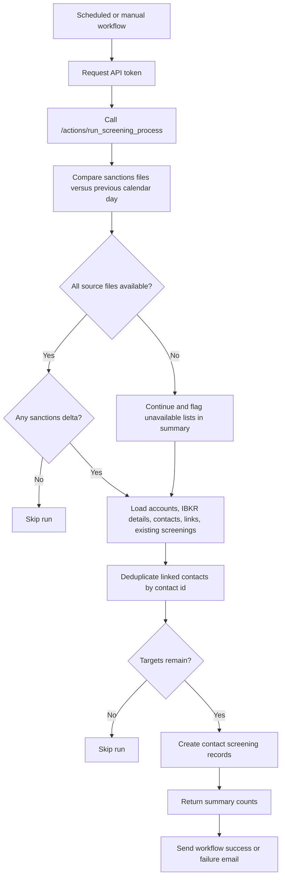

# Daily Screening Run

## Business Purpose
Run the recurring sanctions-screening job for account-linked contacts after checking whether OFAC, UK, and UN backup files changed since the previous calendar day, while also stamping each created screening with a FATF listed-jurisdiction result based on a hardcoded country list. The scheduled job does not necessarily create screening records every day because it exits when all three sanctions files are unchanged.

## Trigger / Frequency
- Trigger: GitHub Actions workflow calls `POST /token` and then `GET /actions/run_screening_process`.
- Frequency: Daily at 14:00 UTC / 8:00 AM Costa Rica time, plus manual workflow dispatch.

## Systems Involved
- `agm-api`
- GitHub Actions
- Supabase-backed `account_contact`, `contact`, and `contact_screening` tables
- Reporting backup used by `get_ibkr_details`
- Sanctions source files managed through the reporting layer

## Roles / Owners
- Primary owner: Andres Aguilar
- Backup owner: Hernan Castro
- Executive oversight: Hernan Castro

## Inputs / Prerequisites
- Current account list from the AGM database
- Latest IBKR details backup
- Current-day and previous-calendar-day sanctions-list backups for OFAC, UK, and UN when available
- Current hardcoded FATF listed-jurisdiction country set used during screening record creation
- Existing contact-screening history
- Working API auth token generated through `/token`

## Step-by-Step Workflow
1. The scheduled GitHub workflow requests an API token and calls `/actions/run_screening_process`.
2. The API compares today’s sanctions backup files against the previous calendar day through `compare_all_sanctions_today_vs_yesterday`. A snapshot is considered present when a backup filename starts with the expected list name and `YYYYMMDD` date.
3. If one or more sanctions files are unavailable, the process logs the gap, includes the unavailable-list detail in the returned summary, and continues instead of failing the run.
4. If all three sanctions lists are available and unchanged, the process exits early and returns a compact “skipped” result.
5. If a list changed, a comparison error occurred, or one or more sanctions files are unavailable, the API loads accounts, IBKR details backup data, account-contact links, contacts, and existing contact screenings.
6. For each account, the workflow attempts to match linked contacts to IBKR associated persons by `entity_id` or normalized name. It reads the associated-person roles but does not use them to exclude trusted contacts.
7. Every account-linked contact with a nonblank contact id and name is added to the candidate population. Contacts appearing under more than one account are deduplicated by contact id, keeping the first account context encountered.
8. The process determines whether the deduplicated contact population is fully covered by screening records dated for the current server date.
9. If every targeted contact already has a screening for today, the process exits with a skipped result.
10. When execution proceeds, the API builds all planned screening payloads in memory, checks OFAC / UK / UN exact normalized-name matches, evaluates the holder residence country against the FATF listed-jurisdiction country set, and inserts the successful payloads as a batch.
11. If only some planned contacts already have a screening dated today, the current implementation still rebuilds and inserts screening rows for the full planned population rather than only the missing contacts.
12. GitHub Actions sends a success or failure email summarizing the run, including sanctions-availability warnings from the API response when present.

## Workflow Diagram

## Outputs / Records Created
- New `contact_screening` records for in-scope contacts when execution occurs
  Each record can contain FATF status of `Listed` or `null`, plus OFAC / UK / UN screening evidence.
- A compact API response summarizing targeted contacts, executed screenings, screening errors, and any sanctions-availability warnings
- GitHub Actions success or failure email notification

## Exception Paths / Failure Handling
- Sanctions file unavailable: process continues, logs the missing list, and includes the unavailable-list detail in the response summary.
- Token generation failure: GitHub workflow exits before calling the screening route.
- Contact-level screening failure: API increments `screening_errors` and continues processing remaining planned contacts.
- No sanctions changes or all targets already screened today: process exits with a skipped result instead of writing new screenings.

## Controls / Verification Points
- Detective control: process compares current and prior sanctions lists before deciding whether to screen.
- Detective control: process returns sanctions-availability warnings in the summary when one or more required dated backups are missing.
- Detective control: every created screening record evaluates the resolved holder residence country against the maintained FATF listed-jurisdiction country set.
- Detective control: a full same-day duplicate screening run is avoided when every targeted contact already has today’s screening date.
- Current limitation: unchanged sanctions files cause the job to skip before it checks whether new or previously unscreened contacts need coverage.
- Current limitation: sanctions and IBKR data are cached per API worker and are not invalidated by this workflow.

## Evidence to Retain
- GitHub Actions run history for `daily_screening.yaml`
- API logs showing sanctions comparison outcome and run summary
- `contact_screening` records created for the current date
- Success or failure notification email generated by the workflow
- API response summary fields for `sanctions_unavailable_lists` and `summary_messages` when present

## Related Code / Pages / Routes
- Entry surfaces: `agm-api/.github/workflows/daily_screening.yaml`, `agm-api/src/app/tools/private/actions.py`
- Supporting modules: `agm-api/src/components/tools/private/screenings.py`, `compliance/processes/15b-compliance-reference-data-refresh.md`, `compliance/processes/16-contact-screening-and-aml-risk-assessment.md`
- Downstream side effects: `agm-api/src/components/clients/contacts.py`, `agm-api/src/components/tools/public/reporting.py`

## Last Reviewed
- Status: draft
- Date: 2026-07-24
- Reviewer: Codex current-state code review
