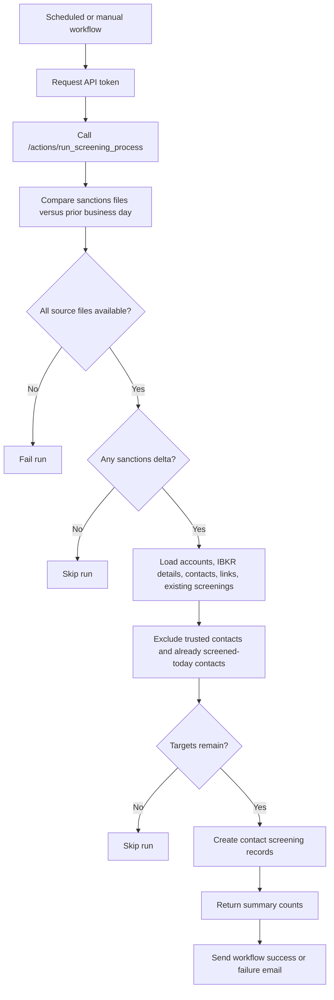

# Daily Screening Run

## Business Purpose
Run the recurring sanctions-screening control for account-linked contacts after checking whether OFAC, UK, and UN sanctions lists changed since the prior business day.

## Trigger / Frequency
- Trigger: GitHub Actions workflow calls `POST /token` and then `GET /actions/run_screening_process`.
- Frequency: Daily at 14:00 UTC / 9:00 AM Costa Rica time, plus manual workflow dispatch.

## Systems Involved
- `agm-api`
- GitHub Actions
- Supabase-backed `account_contact`, `contact`, and `contact_screening` tables
- Reporting backup used by `get_ibkr_details`
- Sanctions source files managed through the reporting layer

## Roles / Owners
- Primary owner: Andres Aguilar
- Backup owner: Hernan Castro
- Executive oversight: Hernan Castro

## Inputs / Prerequisites
- Current account list from the AGM database
- Latest IBKR details backup
- Current and previous sanctions-list snapshots for OFAC, UK, and UN
- Existing contact-screening history
- Working API auth token generated through `/token`

## Step-by-Step Workflow
1. The scheduled GitHub workflow requests an API token and calls `/actions/run_screening_process`.
2. The API compares today’s sanctions files against the previous business day through `compare_all_sanctions_today_vs_yesterday`.
3. If one or more sanctions files are unavailable, the process fails instead of screening against incomplete reference data.
4. If all three sanctions lists are unchanged, the process exits early and returns a compact “skipped” result.
5. If a list changed, the API loads accounts, IBKR details backup data, account-contact links, contacts, and existing contact screenings.
6. For each account, the workflow matches linked contacts to IBKR associated persons by `entity_id` or normalized name.
7. Contacts marked as trusted contacts in IBKR associated-person roles are excluded from targeting.
8. The process determines which contacts are in scope and whether they already have a screening dated for the current day.
9. If every targeted contact already has a screening for today, the process exits with a skipped result.
10. When execution proceeds, the API calls `create_contact_screening_from_contact_id` for each planned contact and records success or error counts.
11. GitHub Actions sends a success or failure email summarizing the run.

## Workflow Diagram

## Outputs / Records Created
- New `contact_screening` records for in-scope contacts when execution occurs
- A compact API response summarizing targeted contacts, executed screenings, and screening errors
- GitHub Actions success or failure email notification

## Exception Paths / Failure Handling
- Sanctions file unavailable: process raises an exception and the workflow fails.
- Token generation failure: GitHub workflow exits before calling the screening route.
- Contact-level screening failure: API increments `screening_errors` and continues processing remaining planned contacts.
- No sanctions changes or all targets already screened today: process exits with a skipped result instead of writing new screenings.

## Controls / Verification Points
- Preventive control: screening does not run when sanctions reference files are incomplete.
- Preventive control: trusted contacts are excluded from targeted screening generation.
- Detective control: process compares current and prior sanctions lists before deciding whether to screen.
- Detective control: same-day duplicate screening runs are avoided when all targeted contacts already have today’s screening date.

## Evidence to Retain
- GitHub Actions run history for `daily_screening.yaml`
- API logs showing sanctions comparison outcome and run summary
- `contact_screening` records created for the current date
- Success or failure notification email generated by the workflow

## Related Code / Pages / Routes
- Entry surfaces: `agm-api/.github/workflows/daily_screening.yaml`, `agm-api/src/app/tools/private/actions.py`
- Supporting modules: `agm-api/src/components/tools/private/screenings.py`
- Downstream side effects: `agm-api/src/components/clients/contacts.py`, `agm-api/src/components/tools/public/reporting.py`

## Last Reviewed
- Status: draft
- Date: 2026-06-16
- Reviewer: Codex initial draft
