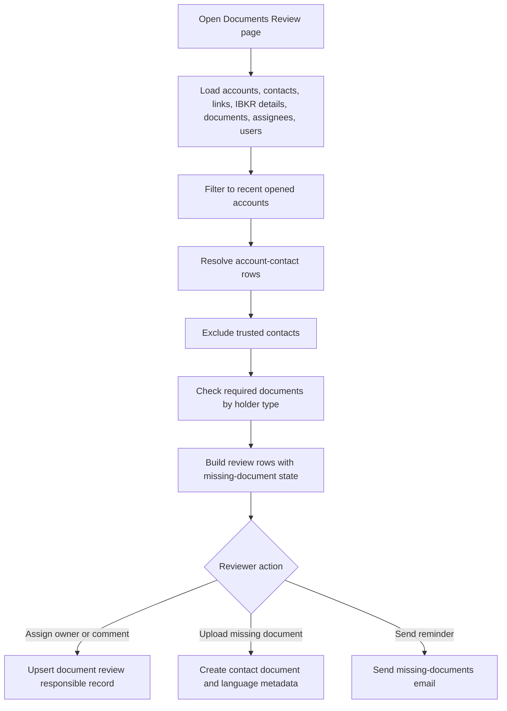

# Documents Review Workflow

## Business Purpose
Provide an operational and compliance review surface for recently opened accounts to identify missing holder documents, assign responsible reviewers, upload missing documents, manually re-link orphaned raw documents, correct incomplete contact-document metadata, send missing-document email reminders, and review IBKR compliance task backlogs.

## Trigger / Frequency
- Trigger: User opens the Dashboard `Documents Review` page, the combined `Accounts Audit` page, or one of its operational tabs such as `Unlinked Documents`, `No Type Documents`, or `IBKR Compliance Tasks`.
- Frequency: On demand.

## Systems Involved
- `agm-dashboard`
- `agm-api`
- Accounts, contacts, account-contact links, contact documents, and review-responsible records
- Daily IBKR details backup
- IBKR compliance task snapshot curated for the Dashboard review page
- Email service for missing-document reminders

## Roles / Owners
- Primary owner: Andres Aguilar
- Backup owner: Hernan Castro
- Executive oversight: Hernan Castro

## Inputs / Prerequisites
- Accounts and contacts data
- Account-contact link records with optional `entity_id`
- Contact-document metadata
- IBKR details backup with account open date, applicant type, and associated-person names, emails, and roles
- IBKR compliance task list with account ids, task metadata, age, and restriction state
- User list for reviewer assignment

## Step-by-Step Workflow
1. A user opens the Dashboard `Documents Review` page or the combined `Accounts Audit` page.
2. The page loads contacts, account-contact links, accounts, IBKR details backup, contact documents, reviewer assignments, and users in parallel.
3. The page filters to accounts opened within the last five years using the IBKR backup `dateOpened`.
4. The page uses database accounts and account-contact links as the source of truth for review rows. It resolves the linked contact directly from the contacts table and excludes trusted contacts only when the IBKR associated-person data identifies the linked relationship as trusted.
5. In the Accounts Audit account view, users can filter for accounts where any IBKR associated person lacks a matching database contact, or where any non-trusted IBKR associated person lacks one. Matching requires an account-contact link to an existing contact and compares linked entity id, external id, or contact email.
6. It determines whether each contact has the required primary document:
   - natural person: `Proof of Identity`
   - company contact: `Proof of Existence`
   A natural-person row never requires or displays `Proof of Existence`, even when linked to an organization account. A company row never requires or displays `Proof of Identity`.
7. It also checks for `Proof of Address` and `Source of Wealth`, producing three requirements per contact: the holder-type primary document, address, and wealth.
8. It builds one review row per account/contact combination showing missing-document status and any assigned responsible user.
9. Reviewers can assign or update the responsible user and review comment through the `document_review_responsibles` upsert flow. The flow keeps one current-state `document_review_responsible` row per account/contact pair at the application level: a later save replaces the stored `user_id` and `comment` values on that row. It does not retain prior assignees, prior comment values, the user who made the change, or a change timestamp beyond the row's mutable `updated` value.
10. Reviewers can upload a missing document, including metadata such as category, type, declared document language, issue date, and expiration date.
11. Localized upload surfaces normalize document categories to the canonical English storage values used by the API, so translated labels such as `Prueba de Identidad` are persisted as `Proof of Identity`.
12. On upload, the API stores the raw file and contact-document metadata without running text extraction or OCR in the upload request or in a background thread.
13. Reviewers can send a missing-documents email using the page-level email dialog. The greeting-name and recipient-email selectors show separate, source-labeled options from both linked database contacts and IBKR associated persons so reviewers can use the IBKR holder details when the two sources disagree. Options are not merged by email. Trusted contacts from either source are excluded. For organization outreach, eligible personal contacts with an email are prioritized ahead of personal contacts without an email and company contacts. The email content is localized in English or Spanish and includes only the missing document categories permitted for the selected contact: POI/POA/SOW for a natural person or POE/POA/SOW for a company. Source-of-Wealth guidance for both contact types includes an income certification by a public or private accountant (`Certificación de ingresos por contador público o privado`). A natural-person email and its compliance-upload link can never request POE, and a company email and link can never request POI. Corporate emails identify the selected company contact by name in the introductory paragraph (`your company {company_name}` / `su sociedad {company_name}`); both Dashboard send paths block the action when the company name is missing, and the API independently rejects a corporate payload without `company_name`. When an upload link is present, the localized secure-upload button appears once below the introduction and again near the bottom of the email. The upload-troubleshooting section presents two fallback delivery channels together: bold `info@agmtechnology.com` and a bold `+1 786 251 1496` linked to the corresponding WhatsApp chat URL. On success, Gmail returns a provider message id and the Dashboard shows a success toast. The application does not persist that message id or a review-linked record of the recipient, source, requested categories, language, initiating user, attempts, failures, or resend history.
14. The missing-documents email can include a direct AGM Hub upload link containing the target `contact_id`, allowing the recipient to upload documents from a public Hub page that writes the files directly into `contact_document`. The Hub contact-document table shows category, type, language, issued date, and expiration date; it hides internal document ids, displays stored `en`/`es` language codes as `English`/`Spanish`, and formats stored timestamps as localized date-only values.
15. Reviewers can open the `Unlinked Documents` page, preview raw `document` rows that are not yet present in `contact_document`, search for the correct contact, create the missing `contact_document` linkage, or delete an orphaned raw document that should not be retained.
16. Reviewers can open the `No Type Documents` page to review linked documents where `contact_document.category` is present but `contact_document.type` is blank or `0`, then correct the metadata before the document continues downstream.
17. Reviewers can open the `IBKR Compliance Tasks` tab to inspect the provided task snapshot in a searchable and exportable table showing task status, assignment date, task age, and account restriction state.

## Workflow Diagram

## Outputs / Records Created
- Review rows derived from current account, account-contact link, and contact records, enriched with IBKR status, NAV, account type, and trusted-contact role data
- Filtered account populations identifying missing database contacts for all IBKR associated persons or only non-trusted associated persons
- Current-state `document_review_responsible` records containing the latest assigned user and comment for each saved account/contact pair; earlier values are overwritten
- Uploaded contact documents and related metadata
- Manually linked `contact_document` records for previously orphaned raw documents
- Deleted orphaned raw `document` records that were intentionally discarded from the queue
- Corrected `contact_document` metadata for records that were missing category or type
- Missing-documents emails to a reviewer-selected database contact or IBKR holder email with localized per-category accepted-document guidance; no structured application database record currently links an email attempt or Gmail message id to the review row
- Optional public AGM Hub compliance-upload links embedded in missing-documents emails
- Reviewable and exportable IBKR compliance task rows derived from the provided task snapshot

## Exception Paths / Failure Handling
- Data-load failure: the page shows an error toast and the review grid is not populated.
- Upload failure: upload dialog remains in the user flow and the user receives a failure toast.
- Missing-document email failure: email dialog surfaces failure and no success notification is shown.
- Assignment or comment correction: saving the correction overwrites the prior values; the application cannot reconstruct the previous value or identify who made either change.
- Email evidence lookup: sent messages may be available in the configured Gmail mailbox, but the application cannot query a review row's send history or distinguish a never-attempted send from an unrecorded prior send.
- Incorrect or incomplete linkages between contacts and accounts can produce false positives and must be manually reviewed.
- Manual relinking can attach a raw document to the wrong contact if the reviewer selects the wrong record, so the document preview and selected contact must be checked before saving.
- Manual deletion can remove a raw document that still needs review, so the preview and filename must be checked before confirming deletion.
- Metadata correction can still leave a document unusable downstream if the reviewer enters the wrong category, type, or language, so the preview and contact context must be checked before saving.

## Controls / Verification Points
- Preventive control: trusted contacts are explicitly excluded from required-document review.
- Preventive control: contact-level requirements are selected by contact type, so natural persons use POI/POA/SOW and companies use POE/POA/SOW without inheriting the other holder type's primary document from the account type.
- Preventive control: corporate missing-document emails require and display the company contact name in both supported languages; frontend validation and API validation both block unnamed corporate outreach.
- Preventive control: trusted contacts from either the database rows or IBKR associated-person details cannot be used as either the greeting name or recipient email for missing-document outreach; matching uses linked entity id, external id, or contact email when available.
- Detective control: source labels keep database contact values and IBKR holder values visibly separate when their names or emails disagree.
- Preventive control: only accounts opened within the last five years are reviewed by this page.
- Detective control: missing-document logic is visible row by row and can be exported or reviewed manually.
- Detective control: account filters expose IBKR associated persons who cannot be matched to an existing database contact through the account-contact relationship.
- Operational state: the latest reviewer assignment and comment are stored in `document_review_responsible` instead of only in the browser, but saves update the existing row and do not provide assignment or comment history.
- Control limitation: the Dashboard reports the immediate Gmail send result, but no application control reconciles email attempts, successful provider message ids, failures, or resends to the account/contact review row.

## Evidence to Retain
- Current `document_review_responsible` values; these records do not evidence previous assignments or comments
- Uploaded document metadata and file records
- `contact_document` linkage records created from the `Unlinked Documents` page
- Audit-visible removal of discarded orphaned raw `document` records from the `Unlinked Documents` queue
- Updated `contact_document` metadata records from the `No Type Documents` page
- Document language metadata
- Missing-documents emails retained in the configured Gmail mailbox where available; the application database does not retain a review-linked email ledger or Gmail message id
- Dashboard exports such as `documents-review.csv`
- Dashboard exports such as `ibkr-compliance-tasks.csv`

## Related Code / Pages / Routes
- Entry surfaces: `agm-dashboard/src/app/(dashboard)/(services)/(tools)/(private)/(compliance)/documents-review/page.tsx`, `agm-dashboard/src/app/(dashboard)/(services)/(tools)/(private)/(compliance)/accounts-audit/page.tsx`, `agm-dashboard/src/app/(dashboard)/(services)/(tools)/(private)/(compliance)/unlinked-documents/page.tsx`
- Supporting modules: `agm-dashboard/src/components/dashboard/tools/private/reporting/documents-review/DocumentsReviewPage.tsx`
- Supporting modules: `agm-dashboard/src/components/dashboard/tools/private/reporting/documents-review/DocumentMetadataQueuePage.tsx`
- Supporting modules: `agm-dashboard/src/components/dashboard/tools/private/reporting/documents-review/UnlinkedDocumentsPage.tsx`
- Supporting modules: `agm-dashboard/src/components/dashboard/tools/private/reporting/documents-review/ibkrComplianceTasks.ts`
- Supporting modules: `agm-hub/src/components/hub/apply/ContactDocuments.tsx`
- Downstream side effects: accounts, contacts, contact documents, document-review-responsibles, `reporting/ibkr_details`, missing-documents email route, AGM Hub public compliance-upload page

## Last Reviewed
- Status: draft
- Date: 2026-07-14
- Reviewer: Codex
