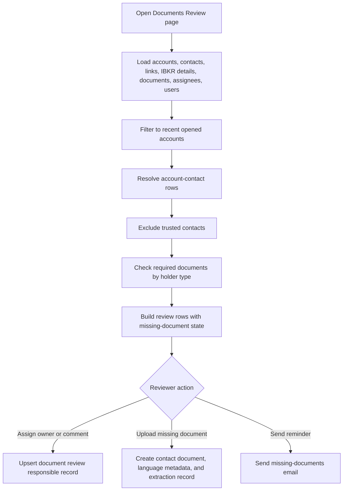

# Documents Review Workflow

## Business Purpose
Provide an operational and compliance review surface for recently opened accounts to identify missing holder documents, assign responsible reviewers, upload missing documents, manually re-link orphaned raw documents, send missing-document email reminders, and review IBKR compliance task backlogs.

## Trigger / Frequency
- Trigger: User opens the Dashboard `Documents Review` page, `Unlinked Documents` page, or the `IBKR Compliance Tasks` tab within the same review surface.
- Frequency: On demand.

## Systems Involved
- `agm-dashboard`
- `agm-api`
- Accounts, contacts, account-contact links, contact documents, and review-responsible records
- Daily IBKR details backup
- IBKR compliance task snapshot curated for the Dashboard review page
- Email service for missing-document reminders

## Roles / Owners
- Primary owner: Andres Aguilar
- Backup owner: Hernan Castro
- Executive oversight: Hernan Castro

## Inputs / Prerequisites
- Accounts and contacts data
- Account-contact link records with optional `entity_id`
- Contact-document metadata
- IBKR details backup with account open date, applicant type, and associated-person roles
- IBKR compliance task list with account ids, task metadata, age, and restriction state
- User list for reviewer assignment

## Step-by-Step Workflow
1. A user opens the Dashboard `Documents Review` page.
2. The page loads contacts, account-contact links, accounts, IBKR details backup, contact documents, reviewer assignments, and users in parallel.
3. The page filters to accounts opened within the last five years using the IBKR backup `dateOpened`.
4. For each account-contact relationship, it matches the linked contact to the relevant account and excludes trusted contacts identified in IBKR associated-person roles.
5. It determines whether each contact has the required primary document:
   - natural person: `Proof of Identity`
   - company contact: `Proof of Existence`
6. It also checks for `Proof of Address` and `Source of Wealth`.
7. It builds one review row per account/contact combination showing missing-document status and any assigned responsible user.
8. Reviewers can assign or update the responsible user and review comment through the `document_review_responsibles` upsert flow.
9. Reviewers can upload a missing document, including metadata such as category, type, declared document language, issue date, and expiration date.
10. On upload, the API stores the contact-document metadata and attempts first-pass text extraction for the new raw file. It uses direct PDF text extraction first and falls back to local OCR for image-based PDFs when direct extraction returns no text, then persists the extraction result and status for downstream review workflows.
11. Reviewers can send a missing-documents email using the page-level email dialog.
12. Reviewers can open the `Unlinked Documents` page, preview raw `document` rows that are not yet present in `contact_document`, search for the correct contact, and create the missing `contact_document` linkage.
13. Reviewers can open the `IBKR Compliance Tasks` tab to inspect the provided task snapshot in a searchable and exportable table showing task status, assignment date, task age, and account restriction state.

## Workflow Diagram

## Outputs / Records Created
- Review rows derived from current source records
- Upserted `document_review_responsible` records
- Uploaded contact documents and related metadata
- Manually linked `contact_document` records for previously orphaned raw documents
- Persisted document text-extraction status and extracted text records for newly uploaded files
- Missing-documents emails to clients
- Reviewable and exportable IBKR compliance task rows derived from the provided task snapshot

## Exception Paths / Failure Handling
- Data-load failure: the page shows an error toast and the review grid is not populated.
- Upload failure: upload dialog remains in the user flow and the user receives a failure toast.
- Text extraction failure: the document upload still succeeds, but the extraction record is marked failed for manual follow-up. Failures can come from unreadable files or missing local OCR dependencies on the API runtime.
- Missing-document email failure: email dialog surfaces failure and no success notification is shown.
- Incorrect or incomplete linkages between contacts and accounts can produce false positives and must be manually reviewed.
- Manual relinking can attach a raw document to the wrong contact if the reviewer selects the wrong record, so the document preview and selected contact must be checked before saving.

## Controls / Verification Points
- Preventive control: trusted contacts are explicitly excluded from required-document review.
- Preventive control: only accounts opened within the last five years are reviewed by this page.
- Detective control: missing-document logic is visible row by row and can be exported or reviewed manually.
- Detective control: reviewer assignment and comment history are stored in dedicated records instead of ad hoc notes.

## Evidence to Retain
- `document_review_responsible` records
- Uploaded document metadata and file records
- `contact_document` linkage records created from the `Unlinked Documents` page
- Document language metadata and text-extraction records
- Missing-documents emails
- Dashboard exports such as `documents-review.csv`
- Dashboard exports such as `ibkr-compliance-tasks.csv`

## Related Code / Pages / Routes
- Entry surfaces: `agm-dashboard/src/app/(dashboard)/(services)/(tools)/(private)/(compliance)/documents-review/page.tsx`, `agm-dashboard/src/app/(dashboard)/(services)/(tools)/(private)/(compliance)/unlinked-documents/page.tsx`
- Supporting modules: `agm-dashboard/src/components/dashboard/tools/private/reporting/documents-review/DocumentsReviewPage.tsx`
- Supporting modules: `agm-dashboard/src/components/dashboard/tools/private/reporting/documents-review/UnlinkedDocumentsPage.tsx`
- Supporting modules: `agm-dashboard/src/components/dashboard/tools/private/reporting/documents-review/ibkrComplianceTasks.ts`
- Downstream side effects: accounts, contacts, contact documents, document processing records, document-review-responsibles, `reporting/ibkr_details`, missing-documents email route

## Last Reviewed
- Status: draft
- Date: 2026-07-07
- Reviewer: Codex
