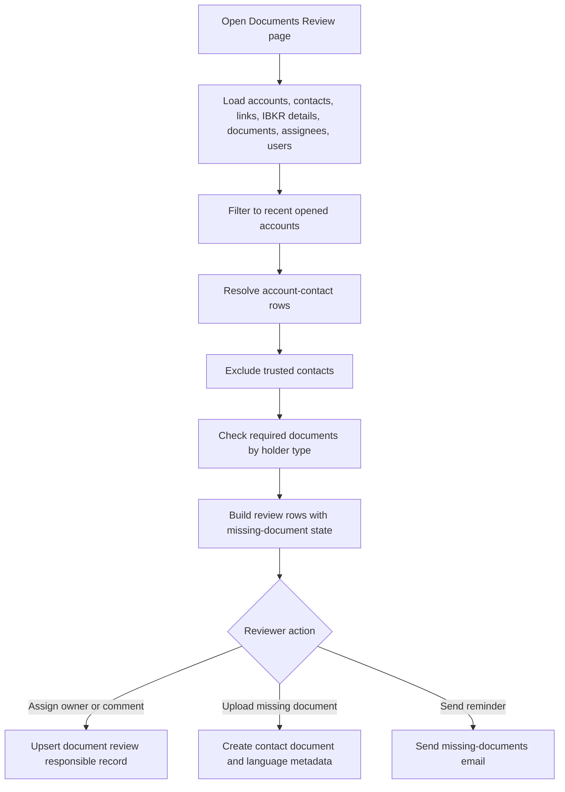

# Documents Review Workflow

## Business Purpose
Provide an operational and compliance review surface for recently opened accounts to identify missing holder documents, assign responsible reviewers, upload missing documents, manually re-link orphaned raw documents, correct incomplete contact-document metadata, send missing-document email reminders, and review IBKR compliance task backlogs.

## Trigger / Frequency
- Trigger: User opens the Dashboard `Documents Review` page, the combined `Accounts Audit` page, or one of its operational tabs such as `Unlinked Documents`, `No Type Documents`, or `IBKR Compliance Tasks`.
- Frequency: On demand.

## Systems Involved
- `agm-dashboard`
- `agm-api`
- Accounts, contacts, account-contact links, contact documents, and review-responsible records
- Daily IBKR details backup
- IBKR compliance task snapshot curated for the Dashboard review page
- Email service for missing-document reminders

## Roles / Owners
- Primary owner: Andres Aguilar
- Backup owner: Hernan Castro
- Executive oversight: Hernan Castro

## Inputs / Prerequisites
- Accounts and contacts data
- Account-contact link records with optional `entity_id`
- Contact-document metadata
- IBKR details backup with account open date, applicant type, and associated-person roles
- IBKR compliance task list with account ids, task metadata, age, and restriction state
- User list for reviewer assignment

## Step-by-Step Workflow
1. A user opens the Dashboard `Documents Review` page or the combined `Accounts Audit` page.
2. The page loads contacts, account-contact links, accounts, IBKR details backup, contact documents, reviewer assignments, and users in parallel.
3. The page filters to accounts opened within the last five years using the IBKR backup `dateOpened`.
4. The page uses database accounts and account-contact links as the source of truth for review rows. It resolves the linked contact directly from the contacts table and excludes trusted contacts only when the IBKR associated-person data identifies the linked relationship as trusted.
5. It determines whether each contact has the required primary document:
   - natural person: `Proof of Identity`
   - company contact: `Proof of Existence`
6. It also checks for `Proof of Address` and `Source of Wealth`.
7. It builds one review row per account/contact combination showing missing-document status and any assigned responsible user.
8. Reviewers can assign or update the responsible user and review comment through the `document_review_responsibles` upsert flow.
9. Reviewers can upload a missing document, including metadata such as category, type, declared document language, issue date, and expiration date.
10. Localized upload surfaces normalize document categories to the canonical English storage values used by the API, so translated labels such as `Prueba de Identidad` are persisted as `Proof of Identity`.
11. On upload, the API stores the raw file and contact-document metadata without running text extraction or OCR in the upload request or in a background thread.
12. Reviewers can send a missing-documents email using the page-level email dialog. The email content is localized in English or Spanish and includes only the missing document categories for that specific contact together with the accepted document guidance for each requested category.
13. The missing-documents email can include a direct AGM Hub upload link containing the target `contact_id`, allowing the recipient to upload documents from a public Hub page that writes the files directly into `contact_document`.
14. Reviewers can open the `Unlinked Documents` page, preview raw `document` rows that are not yet present in `contact_document`, search for the correct contact, create the missing `contact_document` linkage, or delete an orphaned raw document that should not be retained.
15. Reviewers can open the `No Type Documents` page to review linked documents where `contact_document.category` is present but `contact_document.type` is blank or `0`, then correct the metadata before the document continues downstream.
16. Reviewers can open the `IBKR Compliance Tasks` tab to inspect the provided task snapshot in a searchable and exportable table showing task status, assignment date, task age, and account restriction state.

## Workflow Diagram

## Outputs / Records Created
- Review rows derived from current account, account-contact link, and contact records, enriched with IBKR status, NAV, account type, and trusted-contact role data
- Upserted `document_review_responsible` records
- Uploaded contact documents and related metadata
- Manually linked `contact_document` records for previously orphaned raw documents
- Deleted orphaned raw `document` records that were intentionally discarded from the queue
- Corrected `contact_document` metadata for records that were missing category or type
- Missing-documents emails to clients with localized per-category accepted-document guidance
- Optional public AGM Hub compliance-upload links embedded in missing-documents emails
- Reviewable and exportable IBKR compliance task rows derived from the provided task snapshot

## Exception Paths / Failure Handling
- Data-load failure: the page shows an error toast and the review grid is not populated.
- Upload failure: upload dialog remains in the user flow and the user receives a failure toast.
- Missing-document email failure: email dialog surfaces failure and no success notification is shown.
- Incorrect or incomplete linkages between contacts and accounts can produce false positives and must be manually reviewed.
- Manual relinking can attach a raw document to the wrong contact if the reviewer selects the wrong record, so the document preview and selected contact must be checked before saving.
- Manual deletion can remove a raw document that still needs review, so the preview and filename must be checked before confirming deletion.
- Metadata correction can still leave a document unusable downstream if the reviewer enters the wrong category, type, or language, so the preview and contact context must be checked before saving.

## Controls / Verification Points
- Preventive control: trusted contacts are explicitly excluded from required-document review.
- Preventive control: only accounts opened within the last five years are reviewed by this page.
- Detective control: missing-document logic is visible row by row and can be exported or reviewed manually.
- Detective control: reviewer assignment and comment history are stored in dedicated records instead of ad hoc notes.

## Evidence to Retain
- `document_review_responsible` records
- Uploaded document metadata and file records
- `contact_document` linkage records created from the `Unlinked Documents` page
- Audit-visible removal of discarded orphaned raw `document` records from the `Unlinked Documents` queue
- Updated `contact_document` metadata records from the `No Type Documents` page
- Document language metadata
- Missing-documents emails
- Dashboard exports such as `documents-review.csv`
- Dashboard exports such as `ibkr-compliance-tasks.csv`

## Related Code / Pages / Routes
- Entry surfaces: `agm-dashboard/src/app/(dashboard)/(services)/(tools)/(private)/(compliance)/documents-review/page.tsx`, `agm-dashboard/src/app/(dashboard)/(services)/(tools)/(private)/(compliance)/accounts-audit/page.tsx`, `agm-dashboard/src/app/(dashboard)/(services)/(tools)/(private)/(compliance)/unlinked-documents/page.tsx`
- Supporting modules: `agm-dashboard/src/components/dashboard/tools/private/reporting/documents-review/DocumentsReviewPage.tsx`
- Supporting modules: `agm-dashboard/src/components/dashboard/tools/private/reporting/documents-review/DocumentMetadataQueuePage.tsx`
- Supporting modules: `agm-dashboard/src/components/dashboard/tools/private/reporting/documents-review/UnlinkedDocumentsPage.tsx`
- Supporting modules: `agm-dashboard/src/components/dashboard/tools/private/reporting/documents-review/ibkrComplianceTasks.ts`
- Downstream side effects: accounts, contacts, contact documents, document-review-responsibles, `reporting/ibkr_details`, missing-documents email route, AGM Hub public compliance-upload page

## Last Reviewed
- Status: draft
- Date: 2026-07-13
- Reviewer: Codex
