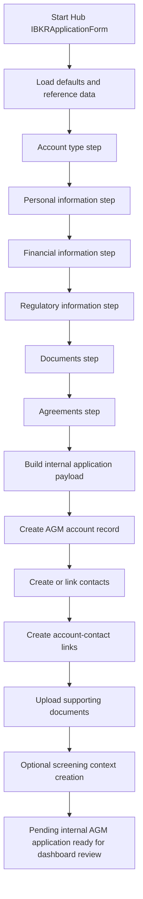

# Account Opening and AGM Account Creation

## Business Purpose
Capture client account-opening data through the Hub workflow, create the internal AGM account record, create or link related contacts, prepare screening and document context, and store the application payload used for downstream onboarding.

## Trigger / Frequency
- Trigger: Client or operator starts the Hub `IBKRApplicationForm`.
- Frequency: On demand.

## Systems Involved
- `agm-hub`
- `agm-api`
- AGM accounts, contacts, account-contact links, and document records
- Hub form schemas and application defaults
- Reference data endpoints for financial ranges, business/occupation types, and IBKR forms

## Roles / Owners
- Primary owner: Andres Aguilar
- Backup owner: Hernan Castro
- Executive oversight: Hernan Castro

## Inputs / Prerequisites
- Valid application schema and default payload
- Reference data from `GetFinancialRanges`, `GetBusinessAndOccupation`, and `GetForms`
- Optional advisor code from the Hub URL
- Applicant personal, financial, regulatory, and document data

## Step-by-Step Workflow
1. The Hub application form loads the application schema defaults and fetches required reference data.
2. The applicant progresses through account type, personal information, financial information, regulatory information, documents, and agreements steps.
3. The form builds an internal application payload that includes account, customer, document, and agreement data.
4. The workflow creates the AGM account record through `/accounts/create` and stores the application payload on the account.
5. It extracts applicant contacts from the application payload and creates or links the contact records needed for the account.
6. It creates or updates account-contact link records so downstream account and review pages can resolve the account holders.
7. It uploads supporting documents and preserves document metadata linked to the proper contact or account context.
8. It can create screening context for the relevant contacts during the onboarding flow.
9. The created account remains an internal AGM application until it is later submitted to IBKR.

## Workflow Diagram

## Outputs / Records Created
- Internal AGM account record with stored application payload
- Contact records for the account holders
- Account-contact relationship records
- Supporting document records and file metadata
- Screening records where the workflow triggers them

## Exception Paths / Failure Handling
- Reference-data load failure: form cannot be completed reliably and surfaces an error toast.
- Validation errors: step navigation stops until required fields are corrected.
- Partial creation failure after account creation: account may exist internally with incomplete linked data and requires operational follow-up.
- Payload serialization or unsupported-value issues are explicitly checked before critical submission steps.

## Controls / Verification Points
- Preventive control: Zod schema validation and step gating reduce malformed application payloads.
- Preventive control: defaults enforce a standard starting shape for tax, financial, and regulatory sections.
- Detective control: internal account record keeps the raw application payload for downstream review.
- Detective control: linked contacts and documents can be reviewed in Dashboard before IBKR submission.

## Evidence to Retain
- Internal account/application payload stored on the account
- Linked contact and account-contact records
- Uploaded document records
- Client-side and server-side logs for onboarding failures

## Related Code / Pages / Routes
- Entry surfaces: `agm-hub/src/components/hub/apply/IBKRApplicationForm.tsx`
- Supporting modules: `agm-hub/src/utils/clients/application.ts`, `agm-hub/src/utils/clients/account.ts`
- Downstream side effects: account, contact, account-contact, screening, and document APIs

## Last Reviewed
- Status: draft
- Date: 2026-06-16
- Reviewer: Codex initial draft
