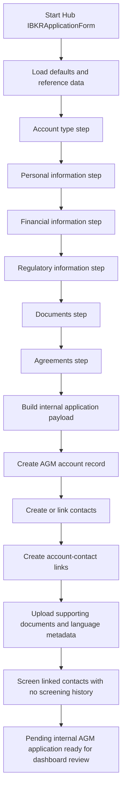

# Account Opening and AGM Account Creation

## Business Purpose
Present bilingual personal and institutional document requirements, capture client account-opening data through the Hub workflow, create the internal AGM account record, create or link related contacts, prepare screening and document context, and store the application payload used for downstream onboarding.

## Trigger / Frequency
- Trigger: Client or operator opens the Hub requirements page or starts the Hub `IBKRApplicationForm`.
- Frequency: On demand.

## Systems Involved
- `agm-hub`
- `agm-api`
- AGM accounts, contacts, account-contact links, and document records
- Hub form schemas and application defaults
- Reference data endpoints for financial ranges, business/occupation types, and IBKR forms

## Roles / Owners
- Primary owner: Andres Aguilar
- Backup owner: Hernan Castro
- Executive oversight: Hernan Castro

## Inputs / Prerequisites
- Valid application schema and default payload
- Reference data from `GetFinancialRanges`, `GetBusinessAndOccupation`, and `GetForms`
- Optional advisor code from the Hub URL
- Applicant personal, financial, regulatory, and document data
- Localized accepted-document guidance for personal and institutional applicants

## Step-by-Step Workflow

### Provider-branded application links

The public application may be opened with `provider_id=<uuid>` (the legacy
`provider`, `application_provider`, and apply-page `id` aliases are also accepted). The Hub
looks up the UUID through the public provider-read API, disables AGM logo
navigation to the index, and applies the provider's validated JSON color
scheme. Without a valid provider record, the normal AGM branding and
navigation remain in effect.
1. The Hub requirements page presents localized personal and institutional document guidance before application, including an income certification by a public or private accountant as an accepted Source-of-Wealth document.
2. The Hub application form loads the application schema defaults and fetches required reference data.
3. The applicant progresses through account type, personal information, financial information, regulatory information, documents, and agreements steps.
4. The form builds an internal application payload that includes account, customer, document, and agreement data.
5. The workflow creates the AGM account record through `/accounts/create` and stores the application payload on the account.
6. It extracts applicant contacts from the application payload and creates or links the contact records needed for the account.
7. It creates or updates account-contact link records so downstream account and review pages can resolve the account holders.
8. It uploads supporting documents, captures declared document language, and preserves document metadata linked to the proper contact context. The contact-document table presents category, type, language, issued date, and expiration date, hides internal ids, displays stored `en`/`es` language codes as `English`/`Spanish`, and formats stored timestamps as localized date-only values.
9. Document uploads store the raw file and metadata without running text extraction or OCR in the API upload flow.
10. When the application is finalized, the Hub reads screening history for each linked contact and calls the contact-screening API only for contacts with no existing screening rows.
11. The created account remains an internal AGM application until it is later submitted to IBKR.

## Workflow Diagram

## Outputs / Records Created
- Internal AGM account record with stored application payload
- Contact records for the account holders
- Account-contact relationship records
- Supporting document records and file metadata
- Document language metadata
- Screening records where the workflow triggers them

## Exception Paths / Failure Handling
- Reference-data load failure: form cannot be completed reliably and surfaces an error toast.
- Validation errors: step navigation stops until required fields are corrected.
- Partial creation failure after account creation: account may exist internally with incomplete linked data and requires operational follow-up.
- Payload serialization or unsupported-value issues are explicitly checked before critical submission steps.

## Controls / Verification Points
- Preventive control: Zod schema validation and step gating reduce malformed application payloads.
- Preventive control: defaults enforce a standard starting shape for tax, financial, and regulatory sections.
- Preventive control: English and Spanish requirement catalogs present the same accepted Source-of-Wealth document options for personal and institutional applicants.
- Detective control: internal account record keeps the raw application payload for downstream review.
- Detective control: linked contacts and documents can be reviewed in Dashboard before IBKR submission.
- Detective control: the Hub document table exposes business-relevant document metadata without displaying internal identifiers or raw timestamp values.

## Evidence to Retain
- Internal account/application payload stored on the account
- Linked contact and account-contact records
- Uploaded document records
- Document language metadata
- Client-side and server-side logs for onboarding failures

## Related Code / Pages / Routes
- Entry surfaces: `agm-hub/src/components/hub/apply/IBKRApplicationForm.tsx`
- Supporting modules: `agm-hub/src/components/hub/requirements/Requirements.tsx`, `agm-hub/src/components/hub/apply/ContactDocuments.tsx`, `agm-hub/src/app/[lang]/en.json`, `agm-hub/src/app/[lang]/es.json`, `agm-hub/src/utils/clients/application.ts`, `agm-hub/src/utils/clients/account.ts`
- Downstream side effects: account, contact, account-contact, screening, and document APIs; see [Contact Screening and AML Risk Assessment](16-contact-screening-and-aml-risk-assessment.md)

## Last Reviewed
- Status: draft
- Date: 2026-07-15
- Reviewer: Codex current-state code review
