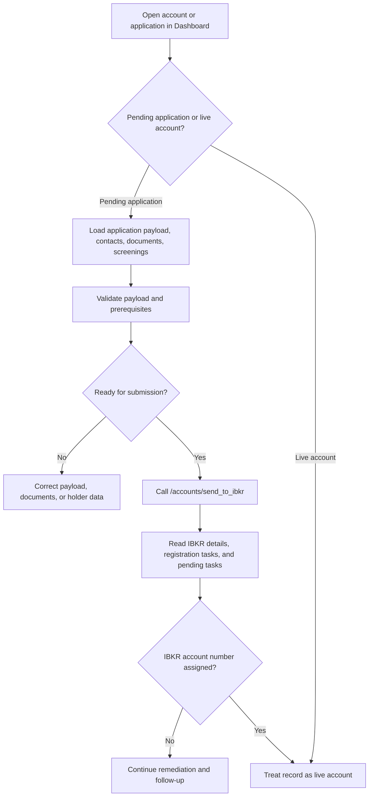

# IBKR Account Submission and Onboarding

## Business Purpose
Move an internally prepared AGM application into the IBKR onboarding process, then monitor and remediate the resulting onboarding state through account details, registration tasks, pending tasks, documents, and related IBKR servicing actions.

## Trigger / Frequency
- Trigger: Operator opens a pending application in Dashboard and chooses to submit it to IBKR.
- Frequency: On demand.

## Systems Involved
- `agm-dashboard`
- `agm-api`
- IBKR onboarding and account-management APIs
- AGM internal account/application data

## Roles / Owners
- Primary owner: Andres Aguilar
- Backup owner: Hernan Castro
- Executive oversight: Hernan Castro

## Inputs / Prerequisites
- Internal AGM account with pending application payload
- Linked documents and holder data required by IBKR
- Chosen `master_account`
- Valid API token and IBKR connectivity

## Step-by-Step Workflow
1. The Dashboard `AccountOrApplicationPage` decides whether the selected record is still a pending application or a live IBKR account.
2. For pending applications, the user works from `ApplicationPage`, which loads the stored internal application payload and supporting records such as contacts, documents, and screenings. Its contact-document table shows category, type, language, issued date, and expiration date, hides internal ids, displays stored `en`/`es` language codes as `English`/`Spanish`, and formats stored timestamps as date-only values.
3. The application payload is validated and prepared for IBKR submission. `ApplicationPage` reads the stored files selected for IBKR, blocks submission with a warning that identifies any document larger than 2 MB, and embeds the remaining documents, including their file data and metadata, in `application.documents`. Submission is also blocked if required documents are missing or any prepared document lacks file data or metadata.
4. The operator triggers `/accounts/send_to_ibkr`, passing the AGM account id, selected master account, and application payload.
5. After submission, Dashboard can query `/accounts/ibkr/details`, `/accounts/ibkr/registration_tasks`, and `/accounts/ibkr/pending_tasks` to follow the onboarding state.
6. Additional onboarding remediation can occur through IBKR document submission, fee template application, trading permissions, CLP capability, and other account-management flows.
7. Once an IBKR account number exists, the record is treated as an account page rather than a pending application page.

## Workflow Diagram

## Outputs / Records Created
- IBKR onboarding submission initiated from AGM
- IBKR detail, registration-task, and pending-task responses used for follow-up
- Updated internal account state as IBKR identifiers and dates become populated

## Exception Paths / Failure Handling
- IBKR submission failure: application remains pending and must be corrected before retry.
- Missing onboarding prerequisites such as documents or malformed payload fields can block submission.
- Registration-task and pending-task read failures prevent monitoring but do not necessarily roll back the submission.

## Controls / Verification Points
- Preventive control: pending-vs-live account branching is determined from account state before rendering the page.
- Preventive control: when the operator sends an application to IBKR, the Dashboard checks the stored documents returned by the API and blocks the request with a warning if any selected document is larger than 2 MB.
- Preventive control: the Dashboard and its IBKR request helper reject submission unless `application.documents` is populated, and the page checks each prepared document for file data and required metadata.
- Preventive control: application payload validation checks run before critical submission.
- Detective control: registration and pending tasks provide a post-submission checklist for follow-up.
- Detective control: supporting documents and screenings can be reviewed from the application context before submission.
- Detective control: the Dashboard document table exposes business-relevant metadata without displaying internal identifiers or raw timestamp values.

## Evidence to Retain
- Stored internal application payload on the AGM account
- Submission results and IBKR identifiers
- Registration-task and pending-task outputs
- Uploaded supporting documents and holder screening records

## Related Code / Pages / Routes
- Entry surfaces: `agm-dashboard/src/components/dashboard/clients/accounts/AccountOrApplicationPage.tsx`, `agm-dashboard/src/components/dashboard/clients/applications/ApplicationPage.tsx`
- Supporting modules: `agm-dashboard/src/components/dashboard/clients/documents/ContactDocuments.tsx`, `agm-dashboard/src/utils/clients/account.ts`
- Downstream side effects: `/accounts/send_to_ibkr`, `/accounts/ibkr/details`, `/accounts/ibkr/registration_tasks`, `/accounts/ibkr/pending_tasks`

## Last Reviewed
- Status: draft
- Date: 2026-07-14
- Reviewer: Codex initial draft
