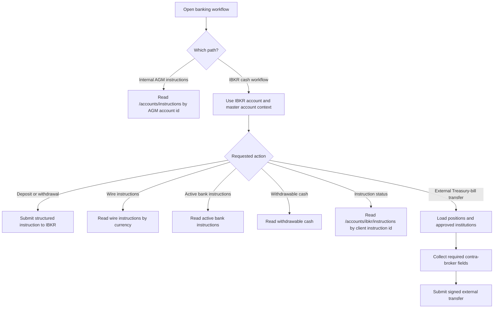

# Account Banking Instructions Handling

## Business Purpose
Maintain two related but distinct banking-instruction workflows: internal AGM banking instructions stored in the database, and IBKR cash-instruction status and cash-availability actions used for deposits, withdrawals, and transfer execution.

## Trigger / Frequency
- Trigger: Operator opens account banking functions in Dashboard or Hub.
- Frequency: On demand.

## Systems Involved
- `agm-dashboard`
- `agm-hub`
- `agm-api`
- AGM internal account-instruction records
- IBKR bank-instruction and cash-operation APIs

## Roles / Owners
- Primary owner: Andres Aguilar
- Backup owner: Hernan Castro
- Executive oversight: Hernan Castro

## Inputs / Prerequisites
- AGM account id
- IBKR account id and master account where required
- Internal stored banking instructions when using `/accounts/instructions`
- Client instruction id when checking IBKR instruction status
- For an external Treasury-bill transfer: selected position quantities, receiving account type, approved broker/custodian, receiving account number, institution country, contact email, contact phone, trade date, and settlement date

## Step-by-Step Workflow
1. Internal banking instructions are read through `/accounts/instructions` using the AGM account id.
2. These internal instructions provide stored banking context maintained in the AGM database.
3. Separately, IBKR cash workflows use the IBKR-specific routes to create deposit or withdrawal instructions and to request wire instructions, active bank instructions, withdrawable cash, or current instruction status.
4. Deposit and withdrawal actions send a structured `instruction` payload to IBKR with the selected account and master account context.
5. Wire instructions are fetched for the account and requested currency.
6. Active bank instructions and withdrawable cash are read using the client instruction id and account context.
7. IBKR instruction status is checked through `/accounts/ibkr/instructions` for an existing client instruction id and the account's master account.
8. For an external Treasury-bill transfer, Dashboard derives the client instruction id, account, direction, quantity, and trading instrument from the selected account and positions, and asks for the required receiving-institution fields plus trade and settlement dates before submitting the signed transfer request.

## Workflow Diagram

## Outputs / Records Created
- Internal AGM banking-instruction reads
- IBKR deposit or withdrawal instructions
- IBKR wire-instruction, active-bank-instruction, withdrawable-cash, and status responses
- External Treasury-bill transfer request and IBKR response

## Exception Paths / Failure Handling
- Missing internal banking-instruction record: internal route returns an empty or partial result set.
- Missing `client_instruction_id` or `master_account`: IBKR instruction-status route returns a 400 error.
- IBKR status responses with HTTP 208 are processed using the returned instruction-result payload.
- Missing account or master account context for IBKR calls: API returns validation errors.
- IBKR-side failures prevent instruction creation or lookup and require operator follow-up.
- External transfer submission is blocked until at least one valid position is selected and all required receiving-institution and date fields pass validation.

## Controls / Verification Points
- Preventive control: internal and external banking flows are separated by route and data source.
- Preventive control: IBKR status and cash-availability routes validate required identifiers before calling downstream services.
- Detective control: operators can compare stored AGM banking instructions against current IBKR instruction status and active bank instructions.

## Evidence to Retain
- Internal banking-instruction records
- IBKR instruction request and response payloads
- Wire-instruction and withdrawable-cash outputs used for the client operation

## Related Code / Pages / Routes
- Entry surfaces: `agm-dashboard/src/utils/clients/account.ts`, `agm-hub/src/utils/clients/account.ts`
- Supporting modules: `agm-api/src/app/clients/accounts.py`
- Downstream side effects: `/accounts/instructions`, `/accounts/ibkr/instructions`, `/accounts/ibkr/active_bank_instructions`, `/accounts/ibkr/withdrawable_cash`, `/accounts/ibkr/wire_instructions`, `/accounts/ibkr/deposit`, `/accounts/ibkr/withdraw`, `/accounts/ibkr/positions`, `/accounts/ibkr/complex_asset_transfer_brokers`, `/accounts/ibkr/external_asset_transfer`

## Last Reviewed
- Status: draft
- Date: 2026-06-16
- Reviewer: Codex initial draft
