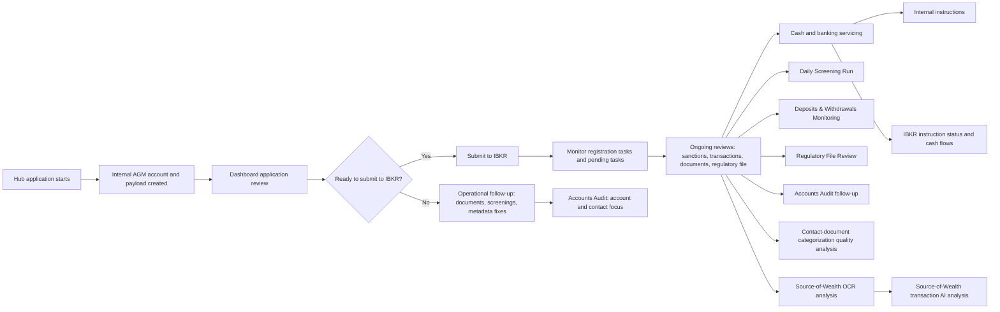

# AGM Process Library

## Purpose
This folder documents AGM operational and analytical processes in a procedure-oriented format that can be used for compliance reviews, operational onboarding, and change tracking.

The process library complements `compliance/ITGC/` by translating application behavior into business workflows with clear triggers, controls, evidence, and code references.

## Scope
This library covers recurring and material workflows executed through:
- `agm-api` scheduled jobs and operational endpoints
- `agm-dashboard` review, analysis, and servicing pages
- `agm-hub` account-opening flows

The unit of documentation is a business process, not an individual endpoint or component.

Confirmed control gaps and remediation acceptance criteria are maintained separately in [Operational Lifecycle Control Gaps](gaps/operational-lifecycle-gaps.md). A gap document describes required future controls and must not be treated as evidence that those controls currently operate.

## Workflow Overview
The current documented lifecycle covers onboarding, compliance-reference refreshes, screening and AML scoring, document review, deposits and withdrawals monitoring, account-level regulatory review, investment-business reporting, and banking operations. Investigation-case management, formal disposition/approval lifecycles, regulatory filing submission, and evidence certification remain control gaps rather than operating processes.

## Naming Convention
- One Markdown file per process.
- Use a numeric prefix to preserve a stable reading order.
- Recommended format: `NN-short-process-name.md`
- Keep file names workflow-oriented, for example `01-daily-screening-run.md` instead of endpoint names.

## Required Sections
Each process document must include:
- Process name
- Business purpose
- Trigger / frequency
- Systems involved
- Roles / owners
- Inputs / prerequisites
- Step-by-step workflow
- Outputs / records created
- Exception paths / failure handling
- Controls / verification points
- Evidence to retain
- Related code / pages / routes
- Last reviewed

Use [_template.md](/Users/aguilarcarboni/Developer/Repositories/AGM/compliance/processes/_template.md) as the starting point.

## Documentation Status
Each process must have one status in [process-register.csv](/Users/aguilarcarboni/Developer/Repositories/AGM/compliance/processes/process-register.csv):
- `inventory`: process identified but not yet written
- `draft`: process documented but still subject to business-owner confirmation
- `reviewed`: process doc confirmed against current business practice

## Documentation Rules
- Every process doc must link the primary code surfaces that implement the workflow.
- Every process doc must identify at least one control point and one retained evidence source.
- When one workflow spans API, Dashboard, and Hub, document it once as a single business process and reference all relevant surfaces.
- When process behavior materially changes, update both the Markdown process doc and the register row in the same change.

## Recommended Authoring Method
For each process, derive the documentation in this order:
1. Entry surfaces
   Routes, scheduled workflows, page entrypoints, or explicit user actions.
2. Supporting code paths
   API component functions, data loaders, joins, filters, emails, uploads, assignments, and backups.
3. Operational interpretation
   Translate the code path into business steps, records touched, validations, outputs, and evidence.

## Relationship to ITGC Artifacts
- The process register in this folder is the working inventory for process mapping.
- `compliance/ITGC/transaction-processing-register.csv` remains the formal transaction register for critical flows.
- High-risk workflows documented here should be reflected in the ITGC transaction register when they represent critical transaction processing.
